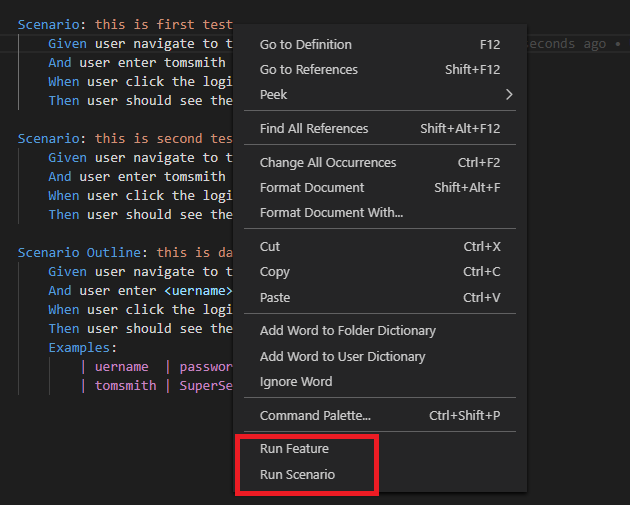

# Cucumber Quick

Cucumber-Quick helps you to run cucumber scenario and features directly from vscode editor. You can simply right click on any feature file and choose the option from the context menu to run a specific scenario or the whole feature file.

## Supported Tools

Currently we support:

- Protractor Cucumber
- WendDriverIo Cucumber
- Native CucumberJS
- Serenity-JS

## Setup Run Configuration

The extension needs to understand what tool you are using and what ae the different parameters specific to your test execution. Follow the steps below:

1. create launch.json file under .vscode folder (ignore if already created)
2. create a debug configuration based on your automation tool (see next section)
3. the name of the configuration should always be **_execute.gherkin_**

#### Protractor-Cucumber/ SerenityJS Configuration

```ts
// .vscode > launch.json

{
	"version": "0.2.0",
	"configurations": [
        {
        // rest of the configurations
        },
        // each key in below JSON is necessary
        {
			"type": "node",
			"request": "launch",
			"name": "execute.gherkin", // do not change the name
			"protocol": "auto",
			"program": "${workspaceFolder}/node_modules/protractor/bin/protractor",
			"stopOnEntry": false,
			"cwd": "${workspaceFolder}",
			"args": ["${workspaceFolder}/protractor.conf.js"], // Advised to add no more args here
			"runtimeArgs": ["--nolazy"],
			"sourceMaps": true,
			"smartStep": true,
			"console": "integratedTerminal"
		}
	]
}

```

#### WebDriverIO Configuration

> Make sure the WebDriverIO-cucumber setup uses wdio-test-runner, that means, it should have cucumberOpts enabled. Remember, the cucumber-boilerplate provided by WebDriverIO uses yadda as cucumber framework. In that case, this extension will not work. But once you switch to wdio-test-runner, this extension will work like magic!

```ts
// .vscode > launch.json

{
	"version": "0.2.0",
	"configurations": [
        {
        // rest of the configurations
        },
        // each key in below JSON is necessary
      {
			"type": "node",
			"request": "launch",
			"name": "execute.gherkin", // do not change the name
			"protocol": "auto",
			"program": "${workspaceRoot}/node_modules/@wdio/cli/bin/wdio.js",
			"stopOnEntry": false,
			"cwd": "${workspaceFolder}",
			"args": ["wdio.conf.js"], // Advised to add no more args here
			"runtimeArgs": ["--nolazy"],
			"sourceMaps": true,
			"smartStep": true,
			"console": "integratedTerminal"
		}
	]
}

```

#### Native Cucumber-JS Configuration

```ts
// .vscode > launch.json

{
	"version": "0.2.0",
	"configurations": [
        {
        // rest of the configurations
        },
        // each key in below JSON is necessary
      {
      "type": "node",
      "request": "launch",
      "name": "execute.gherkin", // do not change the name
      "protocol": "auto",
      "program": "${workspaceRoot}/node_modules/cucumber/bin/cucumber-js",
      "stopOnEntry": false,
      "cwd": "${workspaceFolder}",
      "args": [
        "test/features", // provide feature files folder as first argument
        "--require-module", // provide rest of the required modules
        "ts-node/register",
        "--require",
        "test",
      ],
      "runtimeArgs": ["--nolazy"],
      "sourceMaps": true,
      "smartStep": true,
      "console": "integratedTerminal"
    }
	]
}

```

## Run Scenarios and Features

- Navigate to a specific .feature file
- right click on any scenario name/ scenario outline name
- You can choose two options from the context menu - _Run Scenario_ and _Run Feature_
  
- If _Run Scenario_ is selected, only that specific scenario will be executed
- If _Run Feature_ is selected, the complete feature file will be executed
- The test execution will be performed in debug mode, so if can debug certain codes using breakpoints as well.

If it works for you , give a [Star](https://github.com/abhinaba1080/protractor-react-selector)! :star:

_Copyright &copy; 2020- [Abhinaba Ghosh](https://www.linkedin.com/in/abhinaba-ghosh-9a2ab8a0/)_
